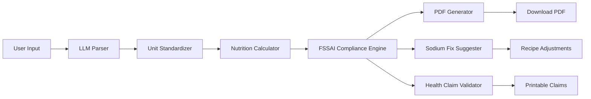

<p align="center">
  
  
  
  
  
</p>

# 🥗 NutriComply — FSSAI Nutrition Label Generator

**NutriComply** is an AI-powered web application that generates **FSSAI-compliant nutrition labels** for food products in seconds. Simply paste your recipe ingredients in natural language, and the system will parse, calculate, validate, and generate a print-ready PDF nutrition label — all conforming to India's **FSSAI Food Safety and Standards (Labelling & Display) Regulations 2020**.

---

## ✨ Features

### 🧪 Core Label Generation
- **Natural Language Parsing** — Paste ingredients like *"500g Almonds, 10g Salt, 5ml Honey"* and the AI extracts structured data automatically
- **Precise Nutrition Calculation** — Powered by **IFCT 2017** (Indian Food Composition Tables) and USDA databases
- **Dual-Column Format** — Per 100g and Per Serving values as mandated by FSSAI
- **PDF Export** — One-click download of print-ready nutrition labels
- **Allergen Detection** — Automatic identification and labelling of allergens
- **Veg/Non-Veg Classification** — Automatic mark assignment based on ingredients

### 🛡️ Compliance Features
- **Smart Sodium Fix Suggester** — When sodium exceeds 600mg/100g, get step-by-step recipe fix suggestions with exact quantity adjustments
- **Health Claim Validator** — Validates your recipe against 13 FSSAI health claim thresholds (Low Fat, High Protein, Sugar Free, etc.) and shows which claims you can legally print on packaging
- **Compliance Score** — Every generated label receives a 0–100 compliance score based on sodium levels, trans fat, mandatory nutrients, and FSSAI license

### 🔐 Authentication & History
- **User Registration & Login** — Secure email/password authentication with PBKDF2-SHA256 hashing
- **Session Persistence** — Remember-me sessions lasting 7 days
- **Label History** — Every generated label is automatically saved to your account
- **Paginated History View** — Browse, download, or delete past labels
- **User-Scoped Security** — Users can only access their own labels (403 for cross-user access)

---

## 🏗️ Architecture

```
fssai-label-generator/
├── app.py                  # Flask application with auth, routes, and label generation
├── db_init.py              # Database migration script (users + label_history tables)
├── requirements.txt        # Python dependencies
├── .env                    # Environment variables (API keys, secret key)
├── .env.example            # Template for .env setup
├── nutrition.db            # SQLite database (nutritional data + users + history)
│
├── engines/                # Core processing engines
│   ├── parser.py           # LLM-based ingredient parser (Groq/Gemini)
│   ├── calculator.py       # Nutrition calculation engine
│   ├── compliance.py       # FSSAI compliance rounding & allergen detection
│   ├── compliance_features.py  # Sodium fixer + Health claim validator
│   ├── label_generator.py  # PDF generation using ReportLab
│   └── external_api.py     # External API integrations
│
├── templates/              # Jinja2 HTML templates
│   ├── landing.html        # Public landing page
│   ├── login.html          # Login page
│   ├── signup.html         # Registration page
│   ├── dashboard.html      # Main label generator interface
│   ├── history.html        # Paginated label history
│   ├── result.html         # Label result view
│   └── index.html          # Index page
│
├── static/
│   ├── style.css           # Complete design system
│   └── labels/             # Generated PDF labels (uuid-named)
│
└── tests/
    ├── test_parser.py
    ├── test_calculator.py
    ├── test_compliance.py
    ├── test_compliance_features.py
    ├── test_integration.py
    ├── test_e2e.py
    └── test_label.py
```

---

## 🚀 Getting Started

### Prerequisites

- Python 3.10+
- A **Groq** API key (free at [console.groq.com](https://console.groq.com/keys)) or a **Google Gemini** API key

### Installation

1. **Clone the repository**
   ```bash
   git clone https://github.com/maneesh-30/DeepVision.git
   cd DeepVision/fssai-label-generator
   ```

2. **Create and activate a virtual environment**
   ```bash
   python -m venv venv

   # Windows
   .\venv\Scripts\activate

   # macOS/Linux
   source venv/bin/activate
   ```

3. **Install dependencies**
   ```bash
   pip install flask reportlab python-dotenv requests flask-login werkzeug
   ```

4. **Configure environment variables**
   ```bash
   cp .env.example .env
   ```
   Edit `.env` and add your API key:
   ```env
   LLM_API_KEY=gsk_your_groq_api_key_here
   SECRET_KEY=your_secret_key_here
   ```
   > **Note:** If `SECRET_KEY` is not set, the app will generate a random one at startup (sessions won't persist across restarts).

5. **Run the application**
   ```bash
   python app.py
   ```

6. **Open in browser**
   ```
   http://localhost:5000
   ```

---

## 🔧 API Key Setup

NutriComply supports two LLM providers for ingredient parsing:

| Provider | Key Prefix | Model Used | Free Tier |
|----------|-----------|------------|-----------|
| **Groq** | `gsk_` | `llama-3.1-8b-instant` | ✅ Yes |
| **Gemini** | `AIza` | `gemini-1.5-flash` | ✅ Yes |

The parser automatically detects the provider based on the key prefix.

---

## 📊 How It Works



1. **Parse** — Raw recipe text is sent to an LLM (Groq/Gemini) which extracts structured ingredient data
2. **Standardize** — All units are converted to grams for consistent calculation
3. **Calculate** — Nutritional values are computed per 100g and per serving using IFCT 2017 / USDA data
4. **Comply** — Values are rounded per FSSAI rules, allergens are detected, and veg/non-veg is classified
5. **Validate** — Sodium levels and health claims are checked against FSSAI thresholds
6. **Generate** — A print-ready PDF label is created and saved to the user's history

---

## 🔒 Security

| Feature | Implementation |
|---------|---------------|
| Password Hashing | PBKDF2-SHA256 via `werkzeug.security` |
| Session Management | Flask-Login with HTTPOnly cookies |
| Cookie Security | `SameSite=Lax`, `HTTPOnly=True` |
| PDF Filenames | UUID4-generated (never from user input) |
| Secret Key | Read from `SECRET_KEY` env var only |
| Data Isolation | All history queries are user-scoped |
| Access Control | Download/delete routes return 403 for wrong user |

---

## 🧪 Running Tests

```bash
# Run all tests
python -m pytest

# Run specific test suites
python -m pytest test_parser.py
python -m pytest test_calculator.py
python -m pytest test_compliance.py
python -m pytest test_compliance_features.py
python -m pytest test_integration.py
python -m pytest test_e2e.py
```

---

## 📋 FSSAI Compliance Scoring

Every generated label receives a compliance score (0–100):

| Condition | Penalty |
|-----------|---------|
| Sodium > 600mg per 100g | -20 points |
| Trans fat > 0.2g per serving | -10 points |
| Any mandatory nutrient missing or zero | -10 points |
| FSSAI license number not provided | -10 points |

---

## 🛣️ Roadmap

- [ ] Batch label generation (CSV upload)
- [ ] Multi-language label support (Hindi, Tamil, etc.)
- [ ] Barcode/QR code integration
- [ ] Export to Excel/CSV
- [ ] Team collaboration features
- [ ] API endpoints for third-party integration

---

## 📄 License

This project is for educational and research purposes.

---

## 👨‍💻 Author

**Maneesh** — [@maneesh-30](https://github.com/maneesh-30)

---

<p align="center">
  Built with ❤️ for Indian food brands who value compliance and speed.
</p>
